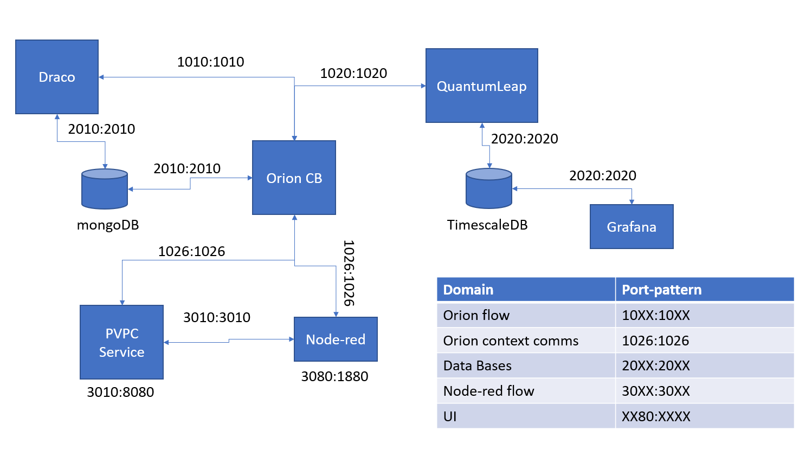

# home-ware
FIWARE implementation of a home automation orchestrator

This Repository will consists on a number of microservices. 

1) Node-red instance to ease debugging and create custom logic flows between microservices.

2) Orion Context Broker instance to store the current context state of the system in a MondoDB using NGSI-v2 data models.

3) QuantumLeap instance that will save timeseries-like context data into a Timescale DB

4) Grafana instance to plot timeseries from the Timescale DB

5) Draco instance to persist historical data in the same MongoDB instance used by Orion CB

6) External microservices:
    1) Python PVPC energy data provider 

